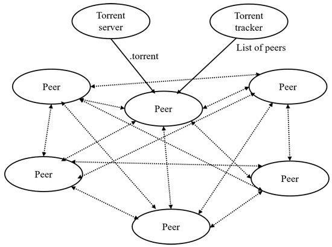
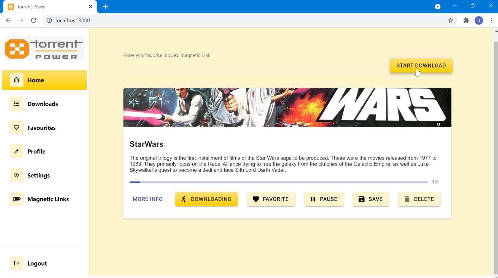
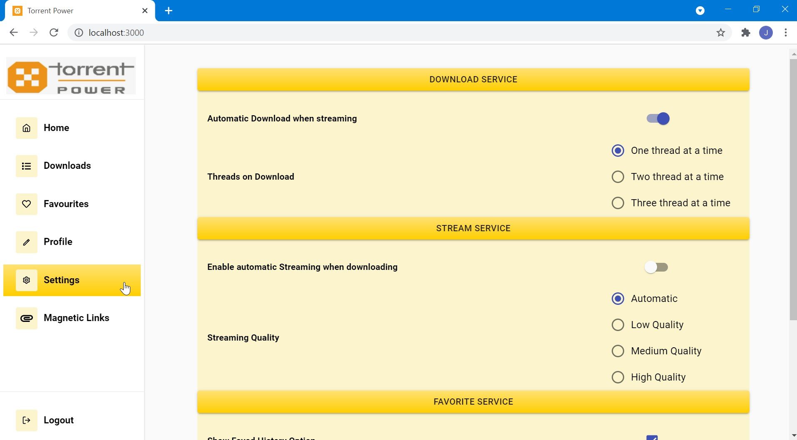

**TORRENT WEB CLIENT**   

PRESENTED BY:                           GUIDEDE BY:

S.JEEVA                                                Mr. K.NARAYANAN M.E.,M.BA,

K.TAMILSELVAN                                  ASSISTANT PROFESSOR             

B.VASANTHAKUMAR

DEPARTMENT OF COMPUTER SCIENCE AND     

ENGINEERING

INSTITUE OF ROAD AND TRANSPORT TECHNOLOGY

# **ABSTRACT**
- The **Distributed File system** makes download easier and faster by peer-to-peer connection. One among them is Torrent. On observing them keenly, we people come up with an idea of making **Torrent Web Client** and made **Torrent Power** web app, which enables users to download torrent files on the easy go. 
- It is highly **platform-independent** since it runs on **any web browser**. Torrent Power also streams your downloading file (video files), so that the user does not need to wait for download completion to watch it. 
- We made Torrent Power as **light** as possible, so the user no need to worry about **RAM consumption**. 
- We aimed to make “Torrent Power”, the **better alternative** for any Torrent Downloaders in the market 
## **INTRODUCTION**
- The term “torrent” refers to **file sharing through a decentralized**, **peer-to-peer (P2P)** sharing network.
- P2P file sharing allows users to exchange files without uploading these to a server.
- Torrenting **doesn’t depend on a centralized server** for storing files. Instead, bits of data from individual large files are saved in participating computers (peers) in a network (swarm) to facilitate the file-sharing process. 
- **Torrent client** (a separate program that reads all the information in the .torrent file and connects users to exchange data).

· A **torrent file (.torrent)** contains information telling users which computers are part of the file-sharing process. It may also provide some details on the files and folders that a user is downloading.
## **TORRENT TERMINALOGIES**
**Peers:** They are members in peer to peer network (P2P)involved in downloading or uploading of files.

**Seeders:** They are the ones seeding files and allowing users to take bits of their data that has been fully downloaded on their computers.

**Leechers:** They are the people who are downloading the file in bits from the seeders.

**Indexers:**The websites which work as a search engine for the files and content to be downloaded through a torrent are known as indexers. ( Torrentz, RarBG , Piratebay )

**Trackers**: Act as bridges in a P2P network transferring small data pieces between uploaders and downloaders.

**Clients**: Are applications that act as requirements for downloading the torrent files. 

(BitTorrent, UTorrent)
# **Peer-To-Peer system**

**SYSTEM SPECIFFCATION**

**HARDWARE SPECIFICATION** 

Processor                 : Intel Pentium 4 

RAM                        : 2.00GB 

System Type            : 32 OR 64 bit 

Speed                       : 10 Mbps 

**SOFTWARE SPEIFICATION** 

Operating System      : Any (Microsoft Windows, LINUX , MacOS)

Web Browser              :Any (Chrome, Firefox, Edge ) 

Tool                           : Visual Studio Code 

Language                  : JavaScript 
# **TECHNOLOGIES USED FOR DEVELOPMENT**
## Programming Language       : JavaScript Backend File Serving           : NodeJS Front End UI                        : HTML, CSS , React JS Front End Design Icons        :  Material UI Data Base                              :  Mongo DB Torrent Service                      : Web Torrent
Peer

\-

to

\-

peer  (seeding peers)

Torrent file/magnetic link

Start

Tracker

Starts downloading/ Streaming i.e leeching

Download Complete

End

seeding

### **MODULES**

MODULE DESCRIPTION:

**SYSTEM IMPLEMENTATION**

**6.11 MODULE DESCRIPTION:**

**Login Page:**

- This is the page where user enter its credentials to enter into portal, which is validated on the server side.
- If the credentials don’t pass the validation, then the user have to retry with the credentials
- If the credentials pass the validation , then the user is redirected to the home page of Torrent Power application

**Navigation Panel:**

- Navigation panel is available on left cornet for the user to navigate to different pages based on his selection.

**Home Page:**

- In this page, the user has to give his magnetic link of the torrent file in text field.
- After giving it, when he click on Start Download option, the torrent file starts downloading
- The status of downloading file is added as Status Card in Home page itself.
- User  can configure the download, by changing the options ( like delete, pause, favorite ) present in the  Status Card 
- When the user clicks the Status Card Picture, then he is redirected to the Streaming Page.

**Streaming Page:**

- Streaming page is where the downloading video is streamed in full view for the user.
- User can exit the streaming page by ‘Esc’ button or Back button of the browser

**Downloads Page:**

- In this page, all the completed downloads are visible to the user.
- The downloads name, file name, file type and file location is show individually for every download in Card View.

**Favorites Page:**

- User all favorite downloads were collected and shown in this section based on file type ( videos / music / books )
- Each favorited item how options for the user to access which includes remove favorite, history, magnetic link, download, stream etc.

**Profile Page:**

- In this page, User’s details are showed which are given at the time of signing up for account in the portal.

**Settings Page:**

- In this page, the user configure his settings for Download service, Streaming service and Favorite service. 

**Magnetic Link Page:**

- This page gives the user the list of preferrable websites from software side, so that user able to get magnetic link for those preferrable website.

**Login Page:**                   Sign In / Sigh Up of user

**Navigation Panel:**         Redirection between different pages

**Home Page:**                   Dowloading through Magnetic Links

**Downloads Page**             Past Dowloads are grouped together

**Favorites Page:**               Favorite items are grouped togther

**Profile Page:**                   Profile Management and user details

**Settings Page:**                 Customizable settings for application 

**Magnetic Links Page:**    Sources to get magnetic links

**Login Page:**

**Home Page:**

**Downloads Page:**

**Favorites :**

**Profile Page :**

**Settings Page:**

**Magnetic Links :**

# **CONCLUSION**
In this paper, downloading torrent file is performed. Using this web app we can download and see streaming of the videos. This project is helps the user to download and streaming through web application “Torrent Power” which is lightweight one and doesn’t need any extra setup to use it. Thus it became the best alternative for all other torrent platforms avail in market.
# **FUTURE ENHANCEMENT**
- Have to **enable encryption** file sharing options with the inclusion of authentication, so that private files can also be shared by Torrent .
- Have to improve the **responsiveness** to all devices, so the user experience will be improved in his device of choice.
- Have to make the software as **lighter** as possible, so that user can use it with low RAM consumption which gives him smooth experience.
- Have to make the whole web application into **progressive web application (PWA)** , so that user can use the software without internet connections.
# **REFERENCES**
- **Web Torrent: A Streaming Torrent Client: [**https](https://github.com/webtorrent)[:](https://github.com/webtorrent)[//github](https://github.com/webtorrent)[.](https://github.com/webtorrent)[com/webtorrent](https://github.com/webtorrent)**
- **How to make your own BitTorrent client :**

[https](https://allenkim67.github.io/programming/2016/05/04/how-to-make-your-own-bittorrent-client.html)[:](https://allenkim67.github.io/programming/2016/05/04/how-to-make-your-own-bittorrent-client.html)[//allenkim](https://allenkim67.github.io/programming/2016/05/04/how-to-make-your-own-bittorrent-client.html)[67.](https://allenkim67.github.io/programming/2016/05/04/how-to-make-your-own-bittorrent-client.html)[github](https://allenkim67.github.io/programming/2016/05/04/how-to-make-your-own-bittorrent-client.html)[.](https://allenkim67.github.io/programming/2016/05/04/how-to-make-your-own-bittorrent-client.html)[io/programming/](https://allenkim67.github.io/programming/2016/05/04/how-to-make-your-own-bittorrent-client.html)[2016/05/04](https://allenkim67.github.io/programming/2016/05/04/how-to-make-your-own-bittorrent-client.html)[/how](https://allenkim67.github.io/programming/2016/05/04/how-to-make-your-own-bittorrent-client.html)[-](https://allenkim67.github.io/programming/2016/05/04/how-to-make-your-own-bittorrent-client.html)[to](https://allenkim67.github.io/programming/2016/05/04/how-to-make-your-own-bittorrent-client.html)[-](https://allenkim67.github.io/programming/2016/05/04/how-to-make-your-own-bittorrent-client.html)[make](https://allenkim67.github.io/programming/2016/05/04/how-to-make-your-own-bittorrent-client.html)[-](https://allenkim67.github.io/programming/2016/05/04/how-to-make-your-own-bittorrent-client.html)[your](https://allenkim67.github.io/programming/2016/05/04/how-to-make-your-own-bittorrent-client.html)[-](https://allenkim67.github.io/programming/2016/05/04/how-to-make-your-own-bittorrent-client.html)[own](https://allenkim67.github.io/programming/2016/05/04/how-to-make-your-own-bittorrent-client.html)[-](https://allenkim67.github.io/programming/2016/05/04/how-to-make-your-own-bittorrent-client.html)[bittorrent](https://allenkim67.github.io/programming/2016/05/04/how-to-make-your-own-bittorrent-client.html)[client](https://allenkim67.github.io/programming/2016/05/04/how-to-make-your-own-bittorrent-client.html)[.](https://allenkim67.github.io/programming/2016/05/04/how-to-make-your-own-bittorrent-client.html)[html](https://allenkim67.github.io/programming/2016/05/04/how-to-make-your-own-bittorrent-client.html)

- **Peer-to-peer networking with BitTorrent :**

[http](http://web.cs.ucla.edu/classes/cs217/05BitTorrent.pdf)[:](http://web.cs.ucla.edu/classes/cs217/05BitTorrent.pdf)[//web](http://web.cs.ucla.edu/classes/cs217/05BitTorrent.pdf)[.](http://web.cs.ucla.edu/classes/cs217/05BitTorrent.pdf)[cs](http://web.cs.ucla.edu/classes/cs217/05BitTorrent.pdf)[.](http://web.cs.ucla.edu/classes/cs217/05BitTorrent.pdf)[ucla](http://web.cs.ucla.edu/classes/cs217/05BitTorrent.pdf)[.](http://web.cs.ucla.edu/classes/cs217/05BitTorrent.pdf)[edu/classes/cs](http://web.cs.ucla.edu/classes/cs217/05BitTorrent.pdf)[217/05](http://web.cs.ucla.edu/classes/cs217/05BitTorrent.pdf)[BitTorrent](http://web.cs.ucla.edu/classes/cs217/05BitTorrent.pdf)[.](http://web.cs.ucla.edu/classes/cs217/05BitTorrent.pdf)[pdf](http://web.cs.ucla.edu/classes/cs217/05BitTorrent.pdf)

- **Bio Torrents: A File Sharing Service for Scientific Data :**

[https](https://journals.plos.org/plosone/article?id=10.1371/journal.pone.0010071)[:](https://journals.plos.org/plosone/article?id=10.1371/journal.pone.0010071)[//journals](https://journals.plos.org/plosone/article?id=10.1371/journal.pone.0010071)[.](https://journals.plos.org/plosone/article?id=10.1371/journal.pone.0010071)[plos](https://journals.plos.org/plosone/article?id=10.1371/journal.pone.0010071)[.](https://journals.plos.org/plosone/article?id=10.1371/journal.pone.0010071)[org/plosone/article?id=](https://journals.plos.org/plosone/article?id=10.1371/journal.pone.0010071)[10.1371](https://journals.plos.org/plosone/article?id=10.1371/journal.pone.0010071)[/journal](https://journals.plos.org/plosone/article?id=10.1371/journal.pone.0010071)[.](https://journals.plos.org/plosone/article?id=10.1371/journal.pone.0010071)[pone](https://journals.plos.org/plosone/article?id=10.1371/journal.pone.0010071)[.0010071](https://journals.plos.org/plosone/article?id=10.1371/journal.pone.0010071)
