**TORRENT 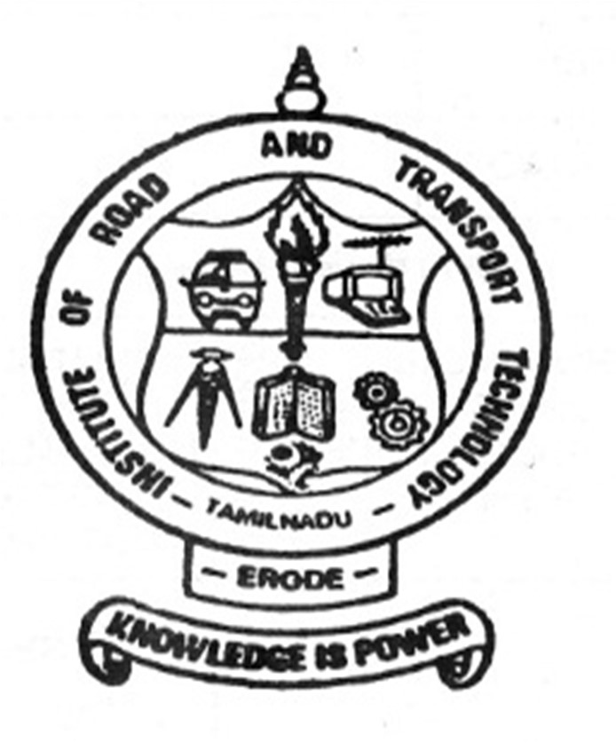WEB CLIENT**                                                   

`   `*A PROJECT REPORT*

`                `*SUBMITTED BY*

`                `**JEEVA S                                   (731117104015)**

`               `**TAMILSELVAN K                  (731117104047)**

`                `**VASANTHAKUMAR B         (731117104048)**
\***

`                      `*In partial fulfilment for the award of the degree of*

**BACHELOR  OF  ENGINEERING**  ***In***

`                      `**COMPUTER SCIENCE AND ENGINEERING**
**
`                      `**INSTITUTE OF ROAD AND TRANSPORT**     

`                               `**TECHNOLOGY - ERODE-638 316.**

`                      `ANNA UNIVERSITY CHENNAI – 600 025.

`                                             `AUGEST - 2021

` `PAGE   \\* MERGEFORMAT 16

`	`**BONAFIDE CERTIFICATE**

` `Certified that this project report  “ **TORRENT  WEB CLIENT** ”  is a bonafide work of  **“ JEEVA. S (731117104015), TAMILSELVAN. K (731117104047) , VASANTHAKUMAR. B (731117104048),”**  who carried out the project under my supervision. 

**SIGNATURE                                                 SIGNATURE** 

**Dr.A.SARADHA M.E.,Ph.D             Mr.K.NARAYANAN M.E.,M.BA**

PROFESSOR,                                           SUPERVISOR, 

HEAD OF THE DEPARTMENT,           ASSISTANT PROFESSOR, 

Department of CSE,                                 Department of CSE, 

Institute of Road and                                Institute of Road and 

Transport Technology,                             Transport Technology,

ERODE-638 316.                                      ERODE-638 316. 

**Submitted for the university examination held on \_\_\_\_\_\_\_\_\_\_ at Institute of Road and Transport Technology, Erode.** 

INTERNAL EXAMINAR                          EXTERNAL EXAMINAR

**ACKNOWLEDGEMENT**

We sincerely express our whole hearted thanks to the Principal **Dr.R.MURUGESAN , M.E., Ph.D.,** Institute of Road ad Transport Technology, Erode for his constant encouragement and moral support during the course of this project. 

We owe our sincere thanks to **Dr.A.SARADHA , M.E., Ph.D.,** Professor and Head of the Department, Department of Computer Science and Engineering, Institute of Road and Transport Technology, Erode for furnishing every essential facility for doing this project. 

We sincerely thank our guide **Mr.K.NARAYANAN M.E.,M.BA.**, Assistant Professor, Department of Computer Science and Engineering, Institute of Road and Transport Technology, Erode, for her valuable help and guidance throughout the project.

We wish to express our sincere thanks to all staff members, Department of Computer Science and Engineering for their valuable help and guidance rendered to us throughout the project.

Above all we are grateful to all our classmates and friends for their friendly cooperation and their exhilarating company.

**TABLE OF CONTENTS**

**CHAPTER                       TITLE                                                      PAGE**         

**NO                                                                                                          NO**

`                               `**ABSTRACT                                                             8**

`                               `**LIST OF FIGURES                                                9**                                                
**

`                                `**LIST OF ABBREVIATONS                                 11**

**1                             INTRODUCTION                                                   12**

1. **WHAT  ARE TORRENT?                        13**  
1. **HOE DOES TORRENTING WORK?     13**
1. **COMMON TORRENT TERMS               14**
1. **ADVANTAGE OF USING TORRENT    14**
1. **DISADVANTAGE OF USING**                  

**TORRENT                                                   15**

**2                             LITERATURE REVIEW                                         16**

**3                            SYSTEM REQUIREMENT**                                     

`                                      `**3.1 HARDWARE SPECFICATION                  18**

`                                      `**3.2 SOFTWARE SPECFICATION                   18**

`                                      `**3.3 SOFTWARE REQUIREMENT                   18**

`                                      `**3.4 SOFTWARE DESCRIPTION**                      

`                                            `**3.4.1 WEB BROWSER                                 19**

`                                            `**3.4.2 JAVASCRIPT                                       20**

`                                            `**3.4.3 NODE JS                                                21**

`                                            `**3.4.4 REACT JS                                             23**

`                                            `**3.4.5 MATERIAL UI                                     24**

`                                            `**3.4.6 WEB TORRENT                                  25**

`                                            `**3.4.7 MANGO DB                                          26**

**4                               SYSTEM ANALYSIS AND DESIGN** 

`                                    `**4.1 USE CASE DIAGRAM                                   27**

`                                    `**4.2 HOW TORRENT WORKS ?**                          

`                                           `**4.2.1 CENTRAL SERVER                             29**

`                                           `**4.2.2 TORRENT PEER-TO-PEER**                     

`                                                     `**CONNECTION                                     30**

`                                     `**4.3 PEER                                                                31**

`                                     `**4.4 SEEDING                                                        31**

`                                     `**4.5 PEER-TO-PEER (P2P)                                  32**

**5                             FEASIBILITY STUDY** 

`                                    `**5.1 OPERATIONAL FESABILITY                    34**

`                                    `**5.2 TECHNICAL FESABILITY                         35**

`                                    `**5.3 ECONOMICAL FEASIBILITY                    35**   
**

**6                           SOFTWARE  TESTING AND SYSTEM**   

`                             `**IMPLEMENTATION**

`                                       `**6.1   NEED FOR TESTING                              36**

`                                       `**6.2   WEB APP TESTING                                 37**   

`                                       `**6.3   FUNCTIONALITIY CHECKING**  

`                                               `**OF WEBSITE                                             37**

`                                       `**6.4   USABILITY TESTING                             38** 

`                                       `**6.5   INTERFACE TESTING                            39**

`                                       `**6.6   DATABSE TESTING                                 49**

`                                       `**6.7   COMPATIBILITY TESTING                  40**

`                                       `**6.8   PERFORMANCE TESTING                    41**

`                                       `**6.9    SECRUITY TESTING                              41**

`                                       `**6.10  CROWD TESTING                                   23**

`                                       `**6.11  MODULE DESCRIPTION                       43**

**7                          APPENDIX**

`                                        `**7.1 SCREENSHOTS                                          45**

**8                          CONCLUSION & FUTURE ENCHANCEMENT**

`                             `**8.1 CONCLUSION                                                       52**

`                             `**8.2 FUTURE ENHACEMENT                                   52**

`                             `**REFERENCES                                                             53**

**ABSTRACT**

`         `The Distributed file system is coming up with greater usage in day-to-day file-sharing activities. It makes download easier and faster by peer-to-peer connection. One among them is Torrent. All types of files are through Torrent sites with greater accessibility. On observing them keenly, we people come up with an idea of making Torrent Web Client and made “Torrent Power” web app, which enables users to download torrent files on the easy go. It is highly platform-independent since it runs on any web browser. Torrent Power also streams your downloading file (video files), so that the user does not need to wait for download completion to watch it. We made Torrent Power as light as possible, so the user no need to worry about RAM consumption. As a whole, we aimed to make “Torrent Power”, the better alternative for any Torrent Downloaders in the market  

**LIST OF FIGURES**

**FIGURE NO                               TITLE                                   PAGE NO**

3.4.3                              Node JS Architecture                                     22

4.1**                                 Use Case Diagram                                          28

4.2.1                               Central Server                                                29

4.2.2                               Torrent peer-to-peer connection                    30

4.5.1                               Peer-to-peer architecture                                32

7.1                                   Login Page                                                     45

7.2                                   Home page                                                     46

7.3                                   Entering Magnetic Link and clicking start 

`                                        `download button                                            46

7.4                                   Downloading Status                                       47

7.5                                   Different Option for Each Downloading

`                                        `Item                                                                 47

7.6                                   Download page                                               48

7.7                                   Scrolling Down Image of 7.6                         48

7.8                                   Favourite page                                             49

7.9                                   Profile page                                                  49

7.10                                 Settings page                                                 50

7.11                                 Scrolling down of image 7.10                      50

7.12                                 Magnetic link page                                       51

7.13                                 Scrolling down of image 7.12                       51

**LIST OF ABRIVATION**

**         DOM   -   Document Object Model

`          `P2P     -    Peer-To-Peer

`	 `SRS     -    System Requirement Specification

`	 `SPA     -    Single Page Application

`	 `SEO    -    Search Engine Optimization

`	 `VPN   -    Virtual Private Network 

`	 `PWA   -    Progressive Web Application

**

**CHAPTER   1**

`          `**INTRODUCTION**

`    `The “Torrent Power” is developed not only to share and download large-sized files quicker as other applications do, but it also aims to be user-friendly.

This “Torrent Power” is designed to enhance the speed of sharing and downloading large files with low client resources and configurations. This application also enables the user to see the downloading videos online, which is the biggest advantage of it.

The user can download the files with the help of their respective magnetic link. This torrent file contains a list of files and integrity metadata about all the pieces, and optionally contains a list of trackers.

This torrent client web application can be used in all operating systems like Windows, Linux, Mac, Chromebook, etc.., since we developed the web application which can be used in all browsers like Chrome, Firefox, Brave, Opera or even Internet Explorer.

**1.1 What Are Torrents?**

`         `The term “torrent” refers to file sharing through a decentralized, peer-to-peer (P2P) sharing network. P2P file sharing allows users to exchange files without uploading these to a server. The term may also refer to the file name extension or metadata that tells trackers—programs that coordinate the transfer of torrents—where to get torrent files.

**1.2 How Does Torrenting Work?** 

Torrenting doesn’t depend on a centralized server for storing files. Instead, bits of data from individual large files are saved in participating computers (peers) in a network (swarm) to facilitate the file-sharing process. A P2P communication protocol like BitTorrent breaks down the files into pieces and moves them from uploaders (seeders) to downloaders (leechers) via a torrent client (a separate program that reads all the information in the .torrent file and connects users to exchange data)

A system of checks and balances described below is applied to make the torrenting process somewhat foolproof:

- A torrent file (.torrent) contains information telling users which computers are part of the file-sharing process. It may also provide some details on the files and folders that a user is downloading.
- The torrent client connects to a tracker, which holds the IP addresses of the devices in a swarm. The tracker forwards the IP addresses to all torrent clients to ensure all peers are connected.
- The torrent client starts the download. Once it receives sufficient bits of data, it also begins to upload the file for the benefit of other users

**1.3 Common Torrent Terms**

**Seed:** 
`     `To seed a torrent is to share it. A torrent's seed count is the number of people sharing the full file. Zero seeds mean nobody can download the entire file.

**Peer:** 

`    `A peer is someone downloading the file from a seeder but who doesn't yet have the full file.

**Leech:** 

`   `Leechers download more than they upload. A leecher might instead upload nothing at all after the full file has been downloaded.

**Swarm:** 

`   `A group of people downloading and sharing the same torrent.

Tracker: A server that tracks all the connected users and helps them find each other.

**Client**:

`   `The program or web service used by a torrent file or magnet link to understand how to download or upload files.

**1.4 Advantages of Using Torrents:**

- The decentralized process used by P2P means that the file we are downloading is not hosted on a main central server. If one download source is not active, we can rely on other sources to complete the download. For regular downloads, if the main server is down, we will not be able to finish the download process.
- Even if we suddenly are disconnected from the Internet or your PC shuts down/restarts, we will be able to complete the download once you’re back online. No need to restart from scratch.
- Even for users with slow Internet speeds, torrents can help you download a file faster than using the ‘traditional’ download process.
- Files are easy to find and download.

**1.5 Disadvantages of Using Torrents:**

- If the file you are after has no ‘seeds’, you will not be able to download it.
- We cannot tell for sure what the file you are downloading contains. We can verify whether the file is genuine by quickly scanning the comment section. Positive feedback represents a green flag there.
- The fact we are downloading and uploading at the same time may take its toll on our bandwidth. If we have a fast Internet connection, we should not be worried about that part.
- Everybody downloading the torrent file you are leeching or seeding can see your public IP address. That includes your ISP or digital copyright groups. To protect your privacy while using torrents, simply use VPN.

**CHAPTER 2**

**LITERATURE REVIEW**

- D. Qiu and R. Srikant, “Modeling and performance analysis of

BitTorrent-like peer-to-peer networks,” in SIGCOMM ’04: Proc. 2004

conference on Applications, technologies, architectures, and protocols

for computer communications. New York, NY, USA: ACM, 2004, pp.

367–378.

- B. Cohen, “Incentives build robustness in BitTorrent,” in First Workshopon Economics of Peer-to-peer Systems, Berkeley, USA, June 2003D.

- ` `Qiu and R. Srikant, “Modeling and performance analysis of BitTorrent-like peer-to-peer networks,” in SIGCOMM ’04: Proc. 2004conference on Applications, technologies, architectures, and protocolsfor computer communications. New York, NY, USA: ACM, 2004, pp.  367–378.

- J. A. Pouwelse, P. Garbacki, D. H. J. Epema, and H. J. Sips, “TheBitTorrent p2p file-sharing system: Measurements and analysis,” in IPTPS’05, 2005, pp. 205–216.

- N. Andrade, M. Mowbray, A. Lima, G. Wagner, and M. Ripeanu,“Influences on cooperation in BitTorrent communities,” in P2PECON’05: Proceedings of the 2005 ACM SIGCOMM workshop on Economicsof peer-to-peer systems. New York, NY, USA: ACM, 2005, pp. 111–115.

- K. andr´e Skevik, V. Goebel, and T. Plagemann, “Analysis of BitTorrentand its use for the design of a p2p based streaming protocol for a hybridcdn,” Delft University of Technology, Tech. Rep., 2004.

- ` `] R. Sherwood, R. Braud, and B. Bhattacharjee, “Slurpie: a cooperative bulk data transfer protocol,” INFOCOM 2004. Twenty-third AnnualJoint Conference of the IEEE Computer and Communications Societies, vol. 2, pp. 941–951, March 2004. ] 

- R. Bindal, P. Cao, W. Chan, J. Medved, G. Suwala, T. Bates, and A. Zhang, “Improving traffic locality in BitTorrent via biased neighbor selection,” in ICDCS ’06: Proc. 26th IEEE International Conference on Distributed Computing Systems. Washington, DC, USA: IEEE Computer Society, 2006, p. 66.

- ` `G. Wu and T. cker Chiueh, “How efficient is BitTorrent?” in Multimedia Computing and Networking 2006, S. Chandra and C. Griwodz, Eds., vol. 6071, no. 1. SPIE, 2006, p. 60710O. [Online]. Available: http://link.aip.org/link/?PSI/6071/60710O/1

**CHAPTER 3**

**SYSTEM SPECIFICATIONS**

**SYSTEM REQUIREMENT** 

**3.1 HARDWARE SPECIFICATION** 

`                `Processor                 : Intel Pentium 3 

`                `RAM                        : 4.00GB 

`                `System Type            : 32 OR 64 bit 

`                `Speed                       : 20 Mbps 

**3.2 SOFTWARE SPEIFICATION** 

`                `Operating System     : Any (Microsoft Windows, 

`                                                    `LINUX , MacOS)

`	      `Web Browser                Any (Chrome, Firefox, Edge ) 

`                `Tool                          : Visual Studio Code 

`                `Language                  : JavaScript 

**3.3 SOFTWARE REQUIREMENTS** 

`               `Front End                       ReactJS, Material UI

`	      `Back End                        NodeJS

`                `Data Base                      MongoDB   

**3.4 SOFTWARE DESCRIPTION** 

**3.4.1 Web Browser:**

A  software application used to access information on the World Wide Web is called a Web Browser. When a user requests some information, the web browser fetches the data from a web server and then displays the webpage on the user’s screen.

Some of the functionalities of web browsers includes :

- The main function is to retrieve information from the World Wide Web and making it available for users
- Visiting any website can be done using a web browser. When a URL is entered in a browser, the web server takes us to that website
- To run Java applets and flash content, plugins are available on the web browser
- It makes Internet surfing easy as once we reach a website we can easily check the hyperlinks and get more and more useful data online
- Browsers user internal cache which gets stored and the user can open the same webpage time and again without losing extra data 
- Multiple webpages can be opened at the same time on a web browser
- Options like back, forward, reload, stop reload, home, etc. are available on these web browsers, which make using them easy and convenient

Common types – **Google Chrome, Mozilla Firefox, Microsoft Edge, Brave** etc..

**3.4.2 JavaScript:**

JavaScript is an open-source and most popular client-side scripting language supported by all browsers. JavaScript is mainly used for enhancing the interaction of the webpage with users by making it more lively and interactive. It is also used for game development and mobile application development.

**JavaScript advantages**:

- Show dynamic content based on the user profile.
- React to user's operations, like mouse clicks events, key presses or pointer movements.
- Support features like auto-validated form entries and interactive drop-down menus.
- Send requests to remote servers, Upload and download files.
- JavaScript code can also create movement and sound
- Ask questions to the users, Get and set cookies, show messages, switch browser tabs.
- Allows the data to be stored in the local storage.

**What makes JavaScript unique?**

- It offers full integration with HTML/CSS.
- Simple things are done quickly without any complication or following strict rules.
- Supported by all major browsers and JavaScript is enabled by default.

**3.4.3 NodeJS:**

` 	`Node.js is a JavaScript runtime environment that is built on Chrome's V8 JavaScript engine. It is open-source and server-side. It is free and is based on the concept of asynchronous programming.

Node.js is free from deadlocks and no function in Node.js directly performs any I/O operations due to which no process is blocked. Since there is no blocking of the processes it is easy to develop scalable systems in Node.js. It's single-threaded, deadlock-free and asynchronous nature makes it memory efficient. Node goes to sleep when there is no task to be performed.

Node.js can be used to develop different applications such as web application which generates dynamic content, in the file system to create, open, read, close, and delete files on the server, command-line application, REST API server, etc.

**Node.js Architecture**

Node.js is a single-threaded model with the Event Loop Model. It doesn't follow the Request/Response Multi-threaded Stateless Model.

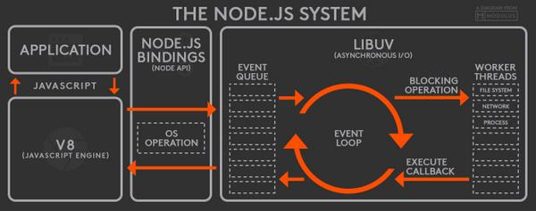

`				`NodeJS Architecture 

**Advantages of Node.js**

It is open-source and free.

- Asynchronous: Node.js is asynchronous i.e. non-blocking. It doesn't wait while the file system opens and reads the file instead it sends the task to the computer's file system and is ready to handle the next request. The asynchronous nature makes it fast.
- No Buffering: Node.js applications don't buffer data. Node.js applications output the data in chunks.
- Is Single-Threaded, Highly Scalable: It follows a single-threaded model with event looping. The server responds in a non-blocking way which makes Node.js based applications highly scalable as compared to traditional servers like Apache.
- It uses JavaScript to build a server-side application.
- It runs on various platforms such as Windows, MAC OS, Linux.

**3.4.4 React JS:**

ReactJS is a front-end JavaScript library for creating user interfaces that is open-source. Facebook and a group of independent developers and businesses manage ReactJS. For online and smartphone applications, it is used to manage the display layer. We can build reusable UI components with ReactJS.

It's an open-source, component-based front-end library that's only responsible for the application's display layer.

**Features of ReactJS**

- **JSX:** An continuation to JavaScript, Though it is not necessary to use JSX in react, it is a useful function that is also simple to use.
- **Components:** Components are the building blocks of React code. Components are pure JavaScript functions that simplify programming by separating logic into interchangeable, separate code. Using the React DOM library, components can be made to a specific entity in the DOM. Components can be used as functions and components can be used as classes. Components have a condition, called props, that makes life easier.
- **Virtual DOM:** The use of a virtual Document Object Model, or virtual DOM, is another noteworthy aspect. React builds an in-memory data structure cache, calculates the variations, and then quickly updates the browser's displayed DOM. Just the most recent DOM updates have been modified in the browser's DOM.
- **JavaScript Expressions:** Curly brackets, for example, can be used to use JS expressions in the JSX files.

**Advantages of ReactJS**

- ReactJS makes use of a virtual DOM that uses an in-memory data structure cache, with only the most recent updates being modified in the browser's DOM. This improves the app's efficiency.
- Using the react component element, you can build components of your choosing. The modules are reusable and useful for code maintenance.
- Since ReactJS is an open-source JavaScript library, it's simple to get started.
- ReactJS has grown in popularity in a limited period of time and is supported by Facebook and Instagram. Many well-known firms, such as Apple and Netflix, use it.
- Since much of the code is performed in JavaScript rather than HTML, it's simple to debug and evaluate.

**3.4.5 Material UI:**

`        `Material UI, on the other hand, is a React-based framework that adheres to Material Design in its applications. It is a React component library that is used by the likes of Amazon, Unity, NASA, to name a few.

**Features of Material UI:**

It provides low-level utility functions called "style functions" for building powerful design systems. 

Some of the key features

- Access the theme values directly from the component props.
- Encourage UI consistency.
- Write responsive style effortlessly.
- Work with any theme object.
- Work with the most popular CSS-in-JS solutions.
- Less than 4 KB zipped.
- Fast enough not to be a bottleneck at runtime.

**3.4.6 Web Torrent:**

- Web Torrent is a streaming torrent client for the web browser and the desktop.
- It is written completely in JavaScript – the language of the web – and uses WebRTC for peer-to-peer transport whenever possible. No browser plugins, extensions, or installation is required to use Web Torrent in your browser.
- In node.js, Web Torrent module is a simple torrent client, using TCP and UDP to talk to other torrent clients.
- In the browser, Web Torrent uses WebRTC (data channels) for peer-to-peer transport. It can be used without browser plugins, extensions, or installations. It's Just JavaScript.

**Features**

- Torrent client for node.js and the browser 
- Insanely fast
- Download multiple torrents simultaneously, efficiently
- Pure JavaScript (no native dependencies)
- Exposes files as streams

\*\* Fetches pieces from the network on-demand so seeking is supported (even before torrent is finished)

\*\* Seamlessly switches between sequential and rarest-first piece selection strategy

- Comprehensive test suite (runs completely offline, so it's reliable and fast)

**3.4.7 MongoDB:**

- MongoDB is a document-oriented NoSQL database used for high-volume data storage. 
- It contains the data model, which allows you to represent hierarchical relationships. 
- It uses JSON-like documents with optional schema instead of using tables and rows in traditional relational databases. 
- Documents containing key-value pairs are the basic units of data in MongoDB.

**Characteristics of MongoDB:**

- Support for ad hoc queries
- Replication
- Indexing
- Load balancing
- Data duplication
- Support for map reduce and aggregation tools
- Schema-less database
- Uses procedures instead of JavaScript
- High performance
- Easy to administrate

**CHAPTER 4**

**SYSTEM ANALYSIS AND DESIGN**

` `**4.1 USE CASE DIAGRAM :**

`           `The Use Case Model describes the proposed functionality of the new system. A Use Case represents a discrete unit of interaction between a user (human or machine) and the system. A Use Case is a single unit of meaningful work. It is a sequence of transaction in an application whose task is to yield result of measurable value to individual author of the application. It is a set of scenarios together by a common user goal.

` `A Use Case description will generally include 

• General comments and notes describing the use case

` `• Requirements - Things that the use case must allow the user to do 

• Constraints - Rules about what can and can't be done, which includes

` `• Scenarios - Sequential descriptions of the steps taken to carry out the use case. It may include multiple scenarios, to cater for exceptional circumstances and alternate processing paths. 

An Actor is a user of the system. This includes both Human users and other computer systems. An Actor uses a Use Case to perform some piece of work which is of value to the business. The set of Use Cases an actor has access to define their overall role in the system and the scope of their action.

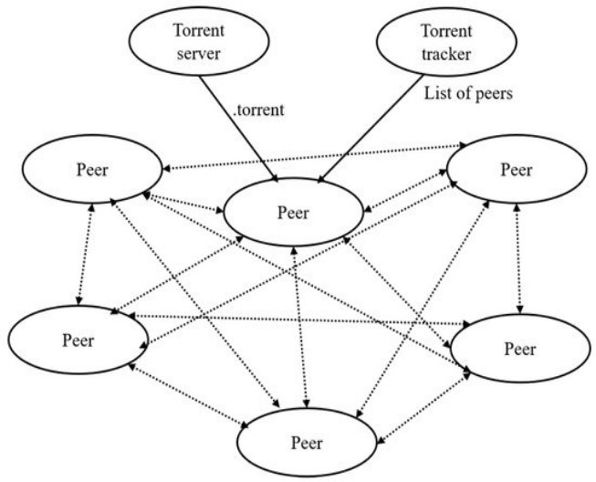

**                                             4.1 – Usecase Diagram

**      The Torrent server share the torrent link to all the peers. The peers contain the contain the files and it’s details which the torrent server sent. If a user try to download the files using the torrent link ,the link contain the details of the file detail and the peers detail. So the torrent client try to download the file from the  peers. So that the network  traffic will be reduced. And the speed of downloading will be increased.

**4.2 HOW TORRENT WORKS :**

` `**4.2.1 CENTRAL SERVER:**

`               `When you download a web page, your computer connects to the web server and downloads the data directly from that server. Each computer that downloads the data downloads it from the web page’s central server. This is how much of the traffic on the web works.

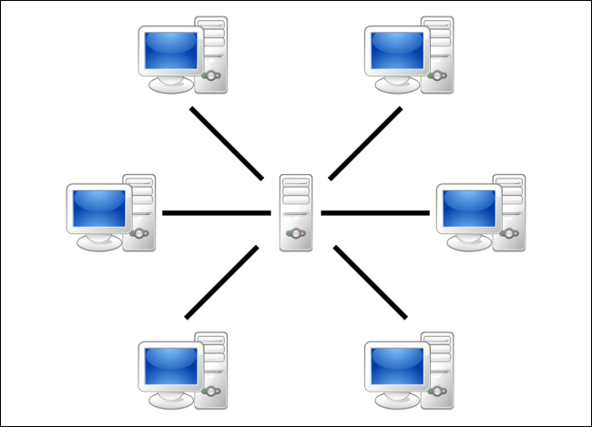

`                                            `( 4.2.1 – Central server ) 

Lot of system shares the central server. So that the downloading speed will be slow and it may causes network traffic.

**4.2.2 TORRENT PEER-TO-PEER CONNECTION** 

`                `Torrent is a peer-to-peer protocol, which means that the computers in a Torrent “swarm” (a group of computers downloading and uploading the same torrent) transfer data between each other without the need for a central server.

`                                    `(4.2.2 – Torrent peer-to-peer connection )

`               `Traditionally, a computer joins a Torrent swarm by loading a .torrent file into a Torrent client. The Torrent client contacts a “tracker” specified in the .torrent file. The tracker is a special server that keeps track of the connected computers. The tracker shares their IP addresses with other Torrent clients in the swarm, allowing them to connect to each other.

`              `Once connected, a Torrent client downloads bits of the files in the torrent in small pieces, downloading all the data it can get. Once the Torrent client has some data, it can then begin to upload that data to other Torrent clients in the swarm. In this way, everyone downloading a torrent is also uploading the same torrent. This speed up everyone’s download speed. If 10,000 people are downloading the same file, it doesn’t put a lot of stress on a central server. Instead, each downloader contributes upload bandwidth to other downloaders, ensuring the torrent stays fast.

`                   `Importantly, Torrent clients never actually download files from the tracker itself. The tracker participates in the torrent only by keeping track of the Torrent clients connected to the swarm, not actually by downloading or uploading data.

**4.3 Peer:**

`          `Files are downloaded in pieces. When a user downloads some parts, he then automatically starts uploading it. A file will be downloaded quicker if more users are involved in the process.

`           `The first time a file is shared, there is a single seed or user who is uploading the file to the first downloader, a peer first creates a small file called a “torrent”. This file contains metadata about the files to be shared and about the tracker, so a torrent will always be relatively slow when it’s just been created, however once that original upload/download process complete the user or users who downloaded the file also known as peers from the original seeds also turn into seeds and then the more popular file is the more seeds are created and the faster the speed will be for newcomers.

**4.4 Seeding:**

`           `Seeding means sharing the files with other peers.  After a torrent job finishes downloading, if you leave the torrent job seeding, it uploads the files to other peers.  The length of time that you should leave the file seeding is not defined, it is recommended that you share until the amount of data you upload reaches at least the same as the amount of data that you have download.

**4.5 Peer-To-Peer (P2P):**

`       `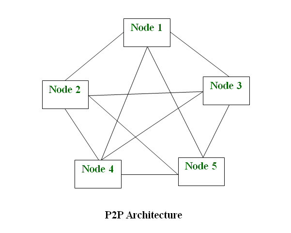
**
`                                 `(4.5.1 – Peer-to-peer architecture)

`                `A peer to peer network is a simple network of computers. Each computer acts as a node for file sharing within the formed network. Here each node acts as a server and thus there is no central server to the network. This allows the sharing of a huge amount of data. The tasks are equally divided amongst the nodes. Each node connected in the network shares an equal workload. For the network to stop working, all the nodes need to individually stop working. This is because each node works independently.

**CHAPTER – 5**

**FEASIBILITY STUDY**
**
`              `A feasibility study is a high-level capsule version of the entire system analysis and Design process. The study begins by classifying the problem definition. Feasibility is to determine if it’s worth doing. Once an acceptance problem definition has been generated, the analyst develops a logical model of the system. A search for alternatives is analysed carefully. There are three parts in feasibility study. 

\1. Operational Feasibility 

\2. Technical Feasibility 

\3. Economical Feasibility 

**5.1 Operational Feasibility** 

`          `Operational feasibility is a measure of how well a proposed system solves the problems, and takes advantages of the opportunities identified during scope definition and how it satisfies the requirements identified in the requirements analysis phase of system development.

The operational feasibility assessment focuses on the degree to which the proposed development projects fits in with the existing business environment and objectives with regard to development schedule, delivery date, corporate culture and existing business process. To ensure success, desired operational outcomes must be imparted during design and development. Therefore operational feasibility is a critical aspect of systems engineering that needs to be an integral part of the early design phases.

**5.2 Technical Feasibility** 

`              `This includes the study of function, performance and constraints that may affect the ability to achieve an acceptance system. For this feasibility study, we studied complete functionality to be provided in the system, as described in the System Requirement Specification (SRS) not added in ABBR list, and checked if everything was possible using different type of frontend and backend platforms. 

**5.3 Economical Feasibility** 

`              `Establishing the cost-effectiveness of the proposed system i.e. if the benefits do not outweigh the costs then it is not worth going ahead. In the fast phased world today there is a great need of online social networking facilities. Thus the benefits of the project in the current scenario make it economically feasible. The purpose of the economic feasibility assessment is to determine the positive economic benefits to the organization that the proposed system will provide. It includes quantification and identification of all the benefits expected. This assessment typically involves a cost/benefit

`  `**CHAPTER 6**

**SOFTWARE TESTING**

`           `After the source code has been completed, documented as related data structures. Completed the project has to undergo testing and validation where there is subtitle and definite attempt to get errors. The project developer treads lightly, designing and execution test that will demonstrates that the program works rather than uncovering errors, unfortunately errors will be present and if the project developer doesn’t find them, the user will find out. The project developer is always responsible for testing the individual units i.e. modules of the program. In many cases developer also conducts integration testing i.e. the testing step that leads to the construction of the complete program structure. 

**6.1 Need for Testing:**

`   `IT landscapes across organizations are becoming increasingly simplified as more applications and services are migrated into a single technology - web-based. However, this also comes with some risks:

If you want to deliver a great end-user experience, web applications and websites must work across multiple browsers, browser versions, operating systems, and devices, including mobile. With all the possible combinations, the number of usage scenarios to be tested explodes. The project has undergone atmost every scenario mentioned here to ensure its correctness.

**6.2 Web App Testing:**

Web testing, or web application testing, is a software practice that ensures quality by testing that the functionality of a given web application is working as intended or as per the requirements. Web testing allows you to find bugs at any given time, prior to a release, or on a day-to-day basis. 

Testing is a highly important part of software development. Whenever there’s a change in the code, no matter how small, bugs can appear somewhere else in the system. The cost of fixing these bugs also rises with time, so having effective web testing in place will ensure you’re time and money in the development of your application.

**6.3 Functionality Testing of a Website**

Functionality Testing of a Website is a process that includes several testing parameters like user interface, APIs, database testing, security testing, client and server testing and basic website functionalities. Functional testing is very convenient and it allows users to perform both manual and automated testing. It is performed to test the functionalities of each feature on the website.

**Test Links:**

Test all links in the webpages are working correctly and make sure there are no broken links. Links to be checked will include -

- Outgoing links
- Internal links
- Anchor Links
- Mail To Links

**Test Forms:**

`  `Test Forms are working as expected. This will include-

- Scripting checks on the form are working as expected. For example- if a user does not fill a mandatory field in a form an error message is shown.
- Check default values are being populated
- Once submitted, the data in the forms is submitted to a live database or is linked to a working email address
- Forms are optimally formatted for better readability

**Test Cookies:**

`    `Test Cookies are working as expected. Cookies are small files used by websites to primarily remember active user sessions so you do not need to log in every time you visit a website. Cookie Testing will include

- Testing cookies (sessions) are deleted either when cache is cleared or when they reach their expiry.
- Delete cookies (sessions) and test that login credentials are asked for when you next visit the site.

**Test HTML and CSS:**

`    `Test HTML and CSS to ensure that search engines can crawl your site easily. This will include

- Checking for Syntax Errors
- Readable Color Schemas
- Standard Compliance. Ensure standards such W3C, OASIS, IETF, ISO, ECMA, or WS-I are followed.

**Test business workflow:**

This will include

- Testing your end - to - end workflow/ business scenarios which takes the user through a series of webpages to complete.
- Test negative scenarios as well, such that when a user executes an unexpected step, appropriate error message or help is shown in your web application.

Tools that can be used: **QTP , IBM Rational , Selenium**

**6.4  Usability testing:**

Usability Testing has now become a vital part of any web based project. It can be carried out by testers like you or a small focus group similar to the target audience of the web application.

**Test the site Navigation**:

Menus, buttons or Links to different pages on your site should be easily visible and consistent on all webpages

**Test the Content**:

Content should be legible with no spelling or grammatical errors.

Images if present should contain an "alt" text

Tools that can be used: **Chalk mark, Click tale, Clixpy and Feedback Army**

**6.5 Interface Testing:**

Three areas to be tested here are - Application, Web and Database Server

**Application:** 

Test requests are sent correctly to the Database and output at the client side is displayed correctly. Errors if any must be caught by the application and must be only shown to the administrator and not the end user.

**Web Server:** 

Test Web server is handling all application requests without any service denial.

**Database Server:** 

Make sure queries sent to the database give expected results.

Test system response when connection between the three layers (Application, Web and Database) cannot be established and appropriate message is shown to the end user.

Tools that can be used: **Alert Fox, Ranorex**

**6.6  Database Testing:**

Database is one critical component of your web application and stress must be laid to test it thoroughly. 

Testing activities will include-

- Test if any errors are shown while executing queries
- Data Integrity is maintained while creating, updating or deleting data in database.
- Check response time of queries and fine tune them if necessary.
- Test data retrieved from your database is shown accurately in your web application

Tools that can be used: **QTP, Selenium**

**6.7 Compatibility testing:**

Compatibility tests ensures that your web application displays correctly across different devices. This would include-

**Browser Compatibility Test:** 

Same website in different browsers will display differently. You need to test if your web application is being displayed correctly across browsers, JavaScript, AJAX and authentication is working fine. You may also check for Mobile Browser Compatibility.

**Operating System Compatibility Test:**

The rendering of web elements like buttons, text fields etc. changes with change in Operating System. Make sure your website works fine for various combination of Operating systems such as Windows, Linux, Mac and Browsers such as Firefox, Internet Explorer, Safari etc.

Tools that can be used: **Net Mechanic**

**6.8 Performance Testing:**

This will ensure your site works under all loads. Software Testing activities will include but not limited to -

- Website application response times at different connection speeds
- Load test your web application to determine its behavior under normal and peak loads
- Stress test your web site to determine its break point when pushed to beyond normal loads at peak time.
- Test if a crash occurs due to peak load, how does the site recover from such an event
- Make sure optimization techniques like zip compression, browser and server side cache enabled to reduce load times

Tools that can be used: **Load runner, JMeter**

**6.9 Security testing:**

Security Testing is vital for e-commerce website that store sensitive customer information like credit cards. 

Testing Activities will include-

- Test unauthorized access to secure pages should not be permitted
- Restricted files should not be downloadable without appropriate access
- Check sessions are automatically killed after prolonged user inactivity
- On use of SSL certificates, website should re-direct to encrypted SSL pages.

Tools that can be used: **Babel Enterprise, BFB Tester and CROSS**

**6.10 Crowd Testing:**

You will select a large number of people (crowd) to execute tests which otherwise would have been executed a select group of people in the company. Crowdsourced testing is an interesting and upcoming concept and helps unravel many a unnoticed defects.

**SYSTEM IMPLEMENTATION**

**6.11 MODULE DESCRIPTION:**

**Login Page:**

- This is the page where user enter its credentials to enter into portal, which is validated on the server side.
- If the credentials don’t pass the validation, then the user have to retry with the credentials
- If the credentials pass the validation , then the user is redirected to the home page of Torrent Power application

**Navigation Panel:**

- Navigation panel is available on left cornet for the user to navigate to different pages based on his selection.

**Home Page:**

- In this page, the user has to give his magnetic link of the torrent file in text field.
- After giving it, when he click on Start Download option, the torrent file starts downloading
- The status of downloading file is added as Status Card in Home page itself.
- User  can configure the download, by changing the options ( like delete, pause, favorite ) present in the  Status Card 
- When the user clicks the Status Card Picture, then he is redirected to the Streaming Page.

**Streaming Page:**

- Streaming page is where the downloading video is streamed in full view for the user.
- User can exit the streaming page by ‘Esc’ button or Back button of the browser

**Downloads Page:**

- In this page, all the completed downloads are visible to the user.
- The downloads name, file name, file type and file location is show individually for every download in Card View.

**Favorites Page:**

- User all favorite downloads were collected and shown in this section based on file type ( videos / music / books )
- Each favorited item how options for the user to access which includes remove favorite, history, magnetic link, download, stream etc.

**Profile Page:**

- In this page, User’s details are showed which are given at the time of signing up for account in the portal.

**Settings Page:**

- In this page, the user configure his settings for Download service, Streaming service and Favorite service. 

**Magnetic Link Page:**

- This page gives the user the list of preferrable websites from software side, so that user able to get magnetic link for those preferrable website.

`                                                       `**CHAPTER 7**

**APPENDIX**

**7.1 SCREENSHOTS**

**Login Page:**

Filling out user credentials

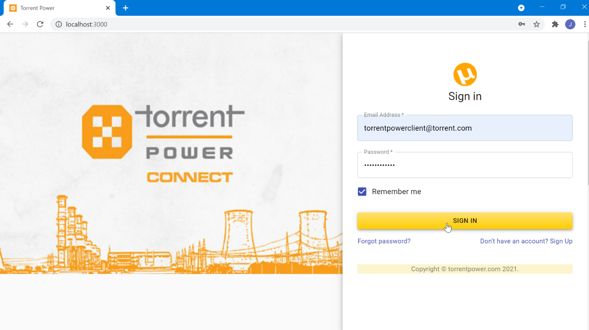

**Home Page:**

Welcome page where user redirected after login

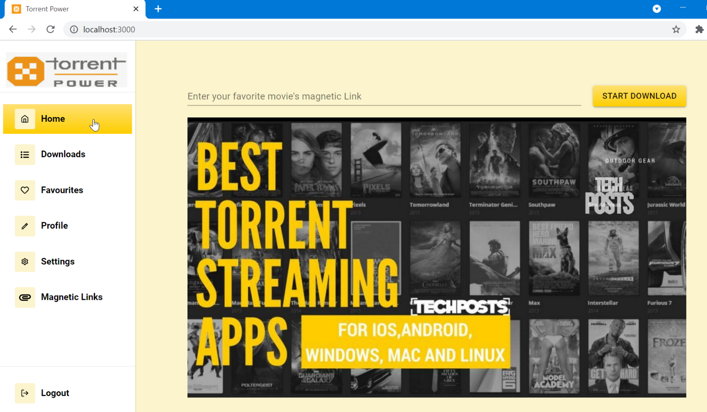

Entering magnetic link and clicking start download button

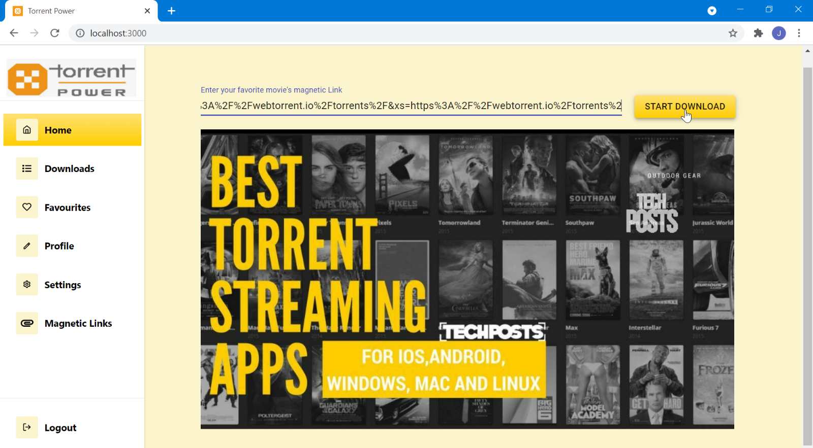

Downloading Status after starting of downloads

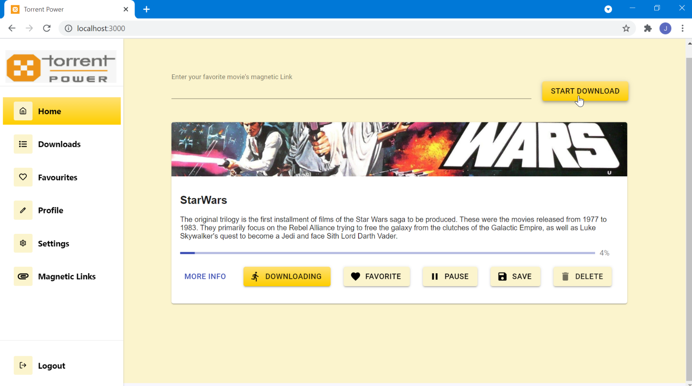

Different Options for each Downloading item 

**Downloads Page:**

Download history containing Downloaded file details

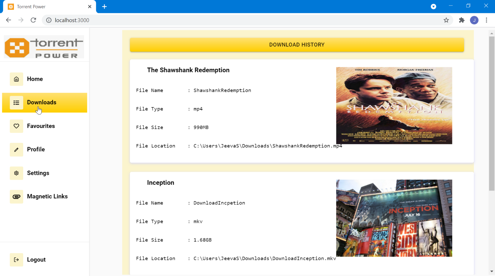

Scrolling down of previous picture:

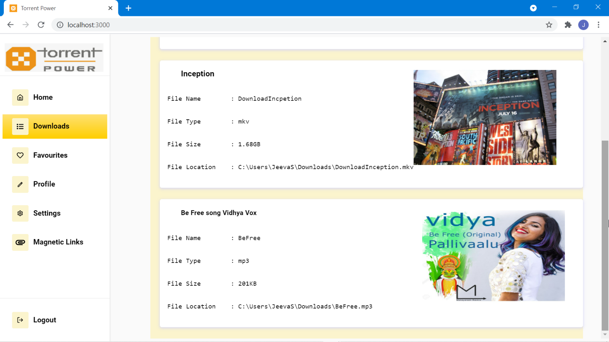

**Favorites Page:**

Different section in favorite bar, each containing different options

**Profile Page:**

Profile page showing user profile details

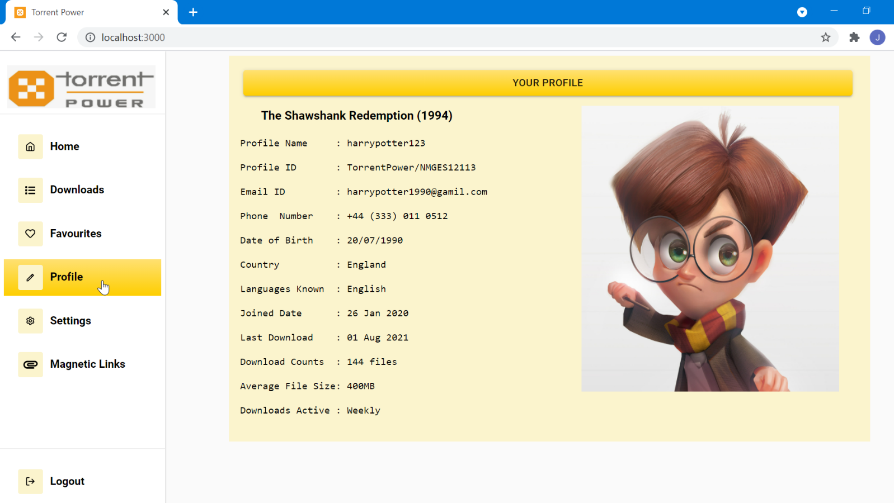

**Settings Page:**

Customizable options in settings page for different sections

Scrolling Down of previous picture

**Magnetic Link Page:**

Showing details info about the magnetic link providing websites

Scrolling down of previous picture

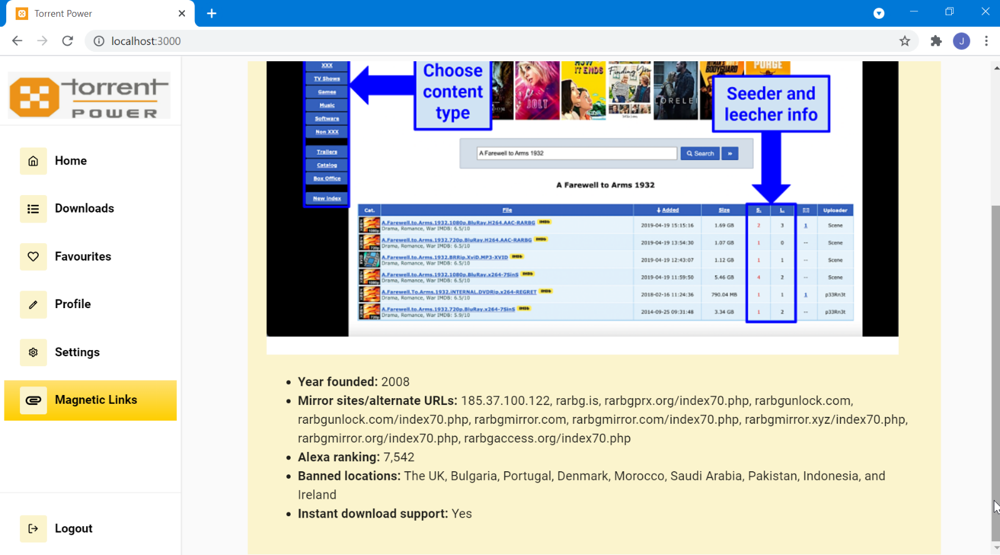

`                                              `**CHAPTER 8**

**CONCLUSION & FURTHER  ENHANCEMENT**

`    `**8.1 CONCLUSION**

In this paper,  downloading torrent file is performed. Using this web app we can download and see streaming of  the videos. This project is helps the user to download and streaming through web application “Torrent Power”  which is lightweight one and doesn’t need any extra setup to use it. Thus it became the best alternative for all other torrent platforms avail in market.
**

` `**8.2 FURTHER  ENHANCEMENT**

- Have to enable encryption file sharing options with the inclusion of authentication, so that private files can also be shared by Torrent .
- Have to improve the Responsiveness to all devices, so the user experience will be improved in his device of choice.
- Have to make the software as light as possible, so that user can use it with low RAM consumption which gives him smooth experience.
- Have to make the whole web application into progressive web application (PWA) , so that user can use the software without internet connections.

**Project CodeBase available at github:** 

[**https://github.com/JS-JeevaSaravanan/torrent_web**](https://github.com/JS-JeevaSaravanan/torrent_web)

**REFERENCES**

- **How to make your own BitTorrent client :**

<https://allenkim67.github.io/programming/2016/05/04/how-to-make-your-own-bittorrent-client.html>

- **Peer-to-peer networking with BitTorrent :** 

<http://web.cs.ucla.edu/classes/cs217/05BitTorrent.pdf>

- **Bio Torrents: A File Sharing Service for Scientific Data :**

<https://journals.plos.org/plosone/article?id=10.1371/journal.pone.0010071>

- **Web Torrent: A Streaming Torrent Client:**

<https://github.com/webtorrent>

